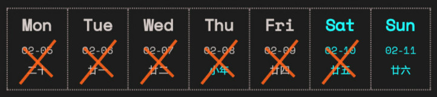
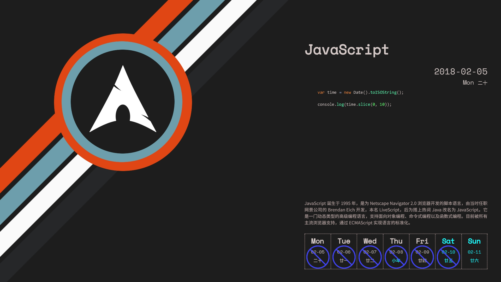
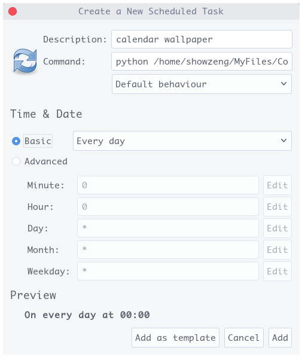

# 2018 编程日历壁纸 (Linux 版)

2018 编程日历壁纸，效果如下


## 特性

* 标记出当天日期
* 支持自定义标记类型、颜色
* 支持自定义背景图片
* 支持自定义日历位置
* 目前仅支持 Gnome shell/Unity 桌面

> 注： 背景图片尺寸仅支持 1920x1080 和 2560x1600 (其他尺寸图片若出图效果不好需要自己调整参数)
> & 其他环境桌面需要修改设置桌面壁纸的相关命令

## 依赖

* [Python3](https://www.python.org)
  * [wand](https://github.com/dahlia/wand)
* [ImageMagick6](http://www.imagemagick.org)
* [Ghostscript](https://www.ghostscript.com/)

## 使用

Python 使用了 wand 依赖

``` bash
~ $ pip install -r requirements.txt
```
至于 ImageMagick(Version 6) 和 Ghostscript 在 Arch 下安装如下，其他发行版到官网或使用相应的包管理工具下载

``` bash
~ $ sudo pacman -S imagemagick6
~ $ sudo pacman -S ghostscript
```
安装好依赖后直接下载解压或克隆本仓库，直接执行 calendar.py 即可

``` bash
~ $ git clone "https://github.com/showzeng/2018_code_calendar_wallpaper_Linux" CalendarWallpaper
~ $ cd CalendarWallpaper/
~/CalendarWallpaper $ python calendar.py
```

## 配置文件

配置文件 config.json 文档如下

| 属性名             | 默认值 | 可设置的值 | 描述 |
|:-----------------:|:-----:|:--------:|:---:|
| mark_type         | 1 | 1/2/3 | 标记当前日期的类型 |
| mark_color        | '#ff4d00' and '#00ff83' | 16 进制/rgb(x,x,x)/rgba(x,x,x,x) | 标记的颜色 |
| position          | right | left/right | 日历居左或居右(此值设定后不应设定下列 left 和 top 的值) |
| left              |  | 如：'20' | 日历距离背景图片左边的像素 |
| top               |  | 如：'40' | 日历距离背景图片顶部的像素 |
| background_image  | 默认背景图 | 图片名称 | 自定义背景图片应放在 wallpaper 文件夹下 |

标记类型

| mark_type 值 | 效果 |
|:------------:|:---:|
| 1 |  |
| 2 |  |
| 3 |  |

## 配置文件使用示例

**1920x1080 背景图片其配置文件及效果图**

``` json
{
	"mark_type": "2",
	"mark_color": "#2A2DFF",
	"position": "",
	"left": "",
	"top": "",
	"background_image": ""
}
```


**2560x1600 背景图片其配置文件及效果图**

``` json
{
	"mark_type": "",
	"mark_color": "",
	"position": "left",
	"left": "",
	"top": "",
	"background_image": "Leopard.jpg"
}
```


## 定时任务

利用 [crontab](http://linuxtools-rst.readthedocs.io/zh_CN/latest/tool/crontab.html) 设置定时任务，在 Arch 仓库找到了 [gnome-schedule](https://github.com/GNOME/gnome-schedule) 这个图形界面工具，安装默认使用核心仓库 [cronie](https://github.com/cronie-crond/cronie) 版本，使用起来很方便，如下所示，新建一个定时任务即可，每天凌晨运行更新壁纸一次。



图中运行命令为 `python` 加上 `calendar.py` 脚本的绝对路径 (最好先将命令在命令行运行一遍，以防止输入错误)，例如我的命令为:

``` bash
python /home/showzeng/MyFiles/CodeFile/CalendarWallpaper/calendar.py
```

添加后运行即可。

## 写在最后

项目起因是因为之前看到 GitHub 上有相应的 Windows 和 Mac 版本，心动不如行动，就写了个 Linux 的实现，并且加入了标记当前日期的特性。

## 参考

* [创意来源](https://www.jianshu.com/p/912ce01d4752)
* [ttttmr 的项目](https://github.com/ttttmr/2018_code_calendar_wallpaper) (Windows 版)
* [RayZhao1998 的项目](https://github.com/RayZhao1998/2018_code_calendar_wallpaper_MacOS) (Mac 版)

> 壁纸部分来源以上仓库和网络，如有版权相关，请联系删除

## License

```
MIT License

Copyright (c) 2018 showzeng

Permission is hereby granted, free of charge, to any person obtaining a copy
of this software and associated documentation files (the "Software"), to deal
in the Software without restriction, including without limitation the rights
to use, copy, modify, merge, publish, distribute, sublicense, and/or sell
copies of the Software, and to permit persons to whom the Software is
furnished to do so, subject to the following conditions:

The above copyright notice and this permission notice shall be included in all
copies or substantial portions of the Software.

THE SOFTWARE IS PROVIDED "AS IS", WITHOUT WARRANTY OF ANY KIND, EXPRESS OR
IMPLIED, INCLUDING BUT NOT LIMITED TO THE WARRANTIES OF MERCHANTABILITY,
FITNESS FOR A PARTICULAR PURPOSE AND NONINFRINGEMENT. IN NO EVENT SHALL THE
AUTHORS OR COPYRIGHT HOLDERS BE LIABLE FOR ANY CLAIM, DAMAGES OR OTHER
LIABILITY, WHETHER IN AN ACTION OF CONTRACT, TORT OR OTHERWISE, ARISING FROM,
OUT OF OR IN CONNECTION WITH THE SOFTWARE OR THE USE OR OTHER DEALINGS IN THE
SOFTWARE.
```